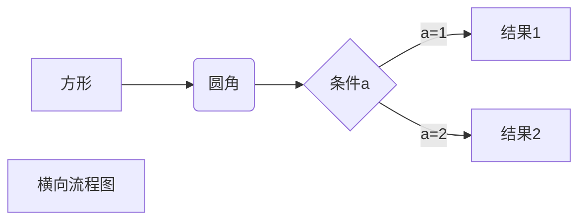
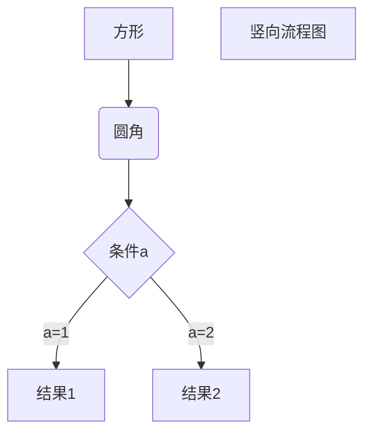

创建的脚本注释例子 [^Study]  像是一个锚点

# 标题1
## 标题2
### 标题3
#### 标题4
##### 标题5
###### 标题6

以下*号和减号是分割线
***
---


一级标题
=
二级标题
-
---

以上类似于HTML的 H1--H6 
***

*两个星号中间文字为斜体文本*
_两个下划线中间文字为斜体文本_
**左右两个星号中间文字为粗体文本**
__两个下划线中间文字为粗体文本__
***左右两个星号中间文字为粗体文本***
___两个下划线中间文字为粗斜体体文本___
***
<u>html的 u 标签实现文字下划线</u>
***

脚注会变成锚点标识，我不明白
[^Study]: 努力学习，笨鸟先飞，锚点内容


### 2. 有序列表+3级标题
**1. 有序列表+粗体文字**
* 无序列表 
+ 无序列表
- 无序列表
***
1. 有序列表：
    * 嵌套无序列表
    + 嵌套无序列表
    - 嵌套无序列表

> 区块引用
>> 区块第一层嵌套
>>> 区块第二层嵌套
>>>> 区块第三层嵌套

> 区块中使用列表
>> 1. 有序列表：
>>> * 无序列表
>>> + 无序列表
>>> - 无序列表

1. 列表中使用区块
    > 好好学习  
    > 天天向上
##### 2. 以上是列表中使用区块
***
` 代码片段 console.log(a); `
``` <span> 这是代码片段</span> ```
``` function(){console.log(a);} ```

4个空格或者一个制表符（Tab键） 实现代码块 需空一行，

    .box2{
            background-color: red;
            position: absolute;
            left: 100px;
            top: 200px;
        }

代码片段两边各3个``` 也可以实现代码块
```
.box2{
            background-color: red;
            position: absolute;
            left: 100px;
            top: 200px;
        } 
```
***
链接[链接名称](https://www.baidu.com)
<https://www.baidu.com> 直接使用链接 需两个尖括号包裹

变量赋值链接： 必须空行 否则变量不生效
变量 a 对应的网址 [百度][a]
变量 b 对应的网址[谷歌][b]

[a]: https://www.baidu.com
[b]: https://www.google.com   
***

图片的语法
小括号内可以使绝对地址或者相对地址，也可以是网络图片地址
同样可以使用变量赋值 类似网站链接
[图片地址][c] 变量名字不要和以上设置的变量名字相同

[c]: ./img/linkedin.png 
冒号后面可以是绝对地址或者相对地址，也可以是网络图片地址
***
|表格的制作|表格的制作|
|---|---| 
|单元格|单元格|
|单元格|单元格|

关键点在|---|---| 这个地方 对齐方式 要看: 在哪个地方

|表头|表头|表头|
|:---|:---:|---:|
|左对齐|中间对齐|右对齐|

***
我们可以直接使用HTML中的标签元素来编写我们想要的内容
例如
5<sup>5</sup>
<kbd>Ctrl</kbd>+<kbd>Alt</kbd>+<kbd>Del</kbd> 重启电脑

转义字符
\***  打印3个星号 不加反斜杠则输出横线
**加粗文本**
\*\*不会加粗文本正常显示星号\*\*
+ 无序列表
\+ 正常显示+号
\\   反斜线
\`   反引号
\*   星号
\_   下划线
\{\}  花括号
\[\]  方括号
\(\)  小括号
\#   井字号
\+   加号
\-   减号
\.   英文句点
\!   感叹号
***
数学表达式
$a$<sup>2</sup>+$b$<sup>2</sup>=$c$<sup>2</sup>

下面的是我在菜鸟教程复制的，我觉得复杂

以下几个实例效果图如下：

1、横向流程图源码格式：


2、竖向流程图源码格式：




